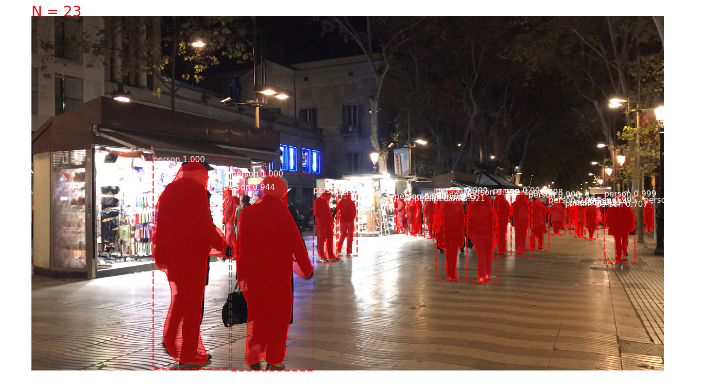
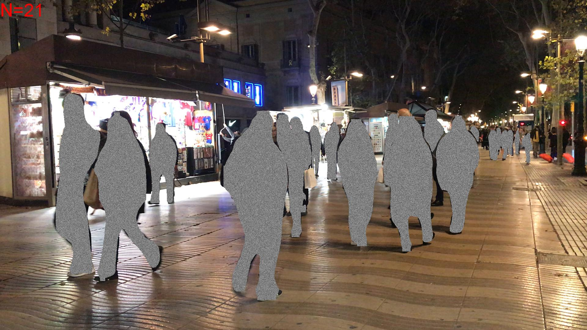

# Citython Barcelona 2018: Crowd recognition system for decision making

## Team members:

1. [Albert López](https://www.linkedin.com/in/albert-l%C3%B3pez-cuadrado-a45381173/) (Architect)
2. [Alejandro Cavazos](https://www.linkedin.com/in/alejandro-cavazos-s-42aa8623/) (Engineering)
3. [Manuel Muñoz](https://www.linkedin.com/in/manuelmunozaguirre/) (Data Scientist)
4. [Marta Guardiola](mailto:martagube@gmail.com) (Architect)
5. [Raziel Amador](https://www.linkedin.com/in/raziel-amador-rios-14161268/) (Data Scientist)

## Content:

1. [Project description](#description)
2. [Deep Neural Network for behaviour identification](#deep)
3. [Data mining: creating maps](#mining)

## 1) <a id='description'></a> Project description
Urban data is a key element to understand different behaviors. We realized that all the information about crowd flow in the city of Barcelona is approximate (i.e. obtained via *Twitter* or other means). For this reason we have developed an **AI model** to collect data about crowd flow with the purpose of generating knowledge. We also think of this model as being **generalizable** to cities around the world that are prone to being gentrified. We reached the conclusion that the city of Barcelona has two main rhythms:

* **Barcelona of the citizens:** determined by the permanent residents in an annual way, considering the seasons of a regular year. The origin of movement for this crowd is their own home, and some of the different destinations are schools, offices, working places, etc.

* **Barcelona of the tourists:** a pattern that has larger variance with respect to the Barcelona of the citizens, but also follows a structure during certain months, year by year. This interaction is interesting because it is currently difficult for stakeholders to obtain clear information about the rhythm and flow of this group. The starting point of each individual or group of persons changes with the decisions they take with regards to their holidays.

Following these lines, we have created tool prototype to analyse and understand the interaction between this two pulses of the city with more accuracy. In practical terms, our system allows to **to count the number of persons in a given spot** using public cameras that already exist as part of infrastructure of Barcelona, **in a way that preserves the privacy**.

This model would also be able to identify **how crowds move in special events like festivals** like *la Mercé, Festa Major de Gràcia,* etc, generating knowledge that is currently limited or unavailable.

## 2) <a id='deep'></a> Deep Neural Network for behaviour identification

We have implemented a computer vision system to count the number of persons in a video. It is based on a deep learning framework, [Mask-RCNN](https://arxiv.org/abs/1703.06870), that has been developed to perform object segmentation, generating masks over detected instances. In order to generate information about people flow in a manner that is **privacy-preserving**, the identified people are masked, but at the same time we are able to keep the information about the number of persons. The particular implementation of *Mask-RCNN* we used is pretrained on the [MS COCO dataset](https://arxiv.org/abs/1405.03120). We have forked from [this repository](https://github.com/minimaxir/person-blocker) and made modifications to suit our task.

The current solution is meant to be a prototype - this means it is not optimized. It reads a video as a sequence of frames and performs the segmentation and count for each frame. When the process is finished, the frames have to be  stitched together using `ffmpeg`.

Required libraries:
- numpy
- imageio
- python 3.4+
- Tensorflow 1.3+
- Keras 2.0.8+
- skimage
- scipy
- Pillow
- cython
- h5py
- matplotlib

The person labelling and person masking functionality is currently separated in **two scripts**. Both of the output the counts on the upper left corner of the image. To run the person labelling script:

```{r}
python label_video_objects.py -i input/my_video.mp4  -c '(128, 128, 128)' -s "person" -w output/myvideo/
```




To run the person masking script:

```{r}
python mask_video.py -i input/my_video.mp4 -c '(128, 128, 128)' -o "person" -w output/myvideo/
```



To stitch the frames with `ffmpeg` use the following command:

```{r}
ffmpeg -start_number 0000 -i frame00%4d.jpg -c:v libx264 outfile.mp4
```
## 3) <a id='mining'></a> Data mining: creating maps

To make our hypothesis about the two Barcelonas (one belonging to the tourist patterns, while the other belongs to the resident patterns), we have mined data from three different sources:
- Yelp API: restaurants that were in a 5km radius from Plaça Catalunya, obtaining around 950 places (there are arounds 5600 places registered but due to API restrictions we could only get around 1k).
- Inside Airbnb: listings and calendar information.
- Opendata Barcelona: coordinates for transport services in Barcelona (metro, tram, train, etc.)

We have manually cleaned this data using R and imported it into QGIS in order to generate visualizations for the two Barcelonas. The animations were stitched together using `ffmpeg`.


